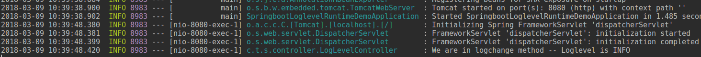

# Springboot loglevel change at runtime #

* This project shows how to change the loglevel in springboot without restarting the application.

### Key Changes ###

..* Use **sl4j Logger** for logging

```private static final Logger log = LoggerFactory.getLogger(LogLevelController.class);```

..* Use **ch.qos.logback.classic.LoggerContext** for change the log level
```   private String setLogLevel(String loglevel) {
        String retVal;
        LoggerContext loggerContext = (LoggerContext) LoggerFactory.getILoggerFactory();
        if(loglevel.equalsIgnoreCase("INFO")){
            loggerContext.getLogger("com.techjava").setLevel(Level.INFO);
            retVal = "Loglevel has changed";
        } else if(loglevel.equalsIgnoreCase("DEBUG")){
            loggerContext.getLogger("com.techjava").setLevel(Level.DEBUG);
            retVal = "Loglevel has changed";
        } else if(loglevel.equalsIgnoreCase("TRACE")){
            loggerContext.getLogger("com.techjava").setLevel(Level.TRACE);
            retVal = "Loglevel has changed";
        } else {
            log.error("Not a known loglevel: " + loglevel);
            retVal = "Error, not a known loglevel: " + loglevel;
        }
        return retVal;
    }
```
### Output ###

Hit Rest URL :  http://localhost:8080/hello



Change loglevel URL : http://localhost:8080/loglevel/debug

After changing hit REST URL: http://localhost:8080/hello
![Loglevel_after_change] (Loglevel_after_change.png)


## Happy Coding ##